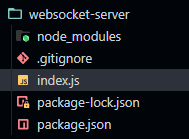
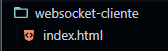

# 😎 Introdução

- O que é?
  1. O websocket é um protocolo de comunicação entre **cliente e servidor**


- Para o que você precisa de um websocket?
  1. Muito utilizado para fazer chats, o websocket, é normalmente usado quando você precisa que o **_SERVIDOR envie informações_** para o cliente.


- No que se difere do protocolo HTTP?
   1. No HTTP, o cliente é sempre o que abre a conexão e faz a requisição... depois o servidor responde e a conexão é encerrada (se ele precisar de mais informações, terá de abrir uma nova conexão).

   1. No websocket, o cliente pede para abrir uma conexão constante com o servidor. Se a conexão for aceita: a conexão fica aberta até algumas das partes dizer pra fechar. Enquanto essa conexão estiver aberta tanto o cliente quanto o servidor podem mandar mensagens um para o outro

---

---

---

---

# 🔌 Requisitos para seguir esse tutorial

1. Node.js
1. npm (vem junto com Node no instalador do windows)
1. Editor de texto favorito (foi utilizado o visual studio code para fazer esse tutorial)

---

---

---

---

# ⚙️ Server Websocket - Como criar

1. Crie uma pasta vazia com seguinte nome:

   `websocket-server`

1. Abra o terminal na pasta criada

1. Crie um novo projeto node usando o seguinte comando:

   ```console
       npm init --yes
   ```

1. Antes de criarmos o nosso websocket, é necessário configurar algumas opções do projeto no 'package.json'. O código inicial dele deve ser:

   ```json
   {
     "name": "websocket-server",
     "version": "1.0.0",
     "description": "",
     "main": "index.js",
     "scripts": {
       "dev": "node index.js"
     },
     "keywords": [],
     "author": "",
     "license": "ISC"
   }
   ```

1. É recomendado baixar um arquivo '.gitignore' para o seu projeto. Você pode baixar o próprio do [github](https://github.com/github/gitignore/blob/main/Node.gitignore). Isso mantém o seu projeto bonitinho e sem erros chatos de arquivo temporários. Quando você baixar o arquivo é importante que o nome esteja exatamente **.gitignore** e que esteja na pasta do projeto (que a gente criou acima).

1. Instale a seguinte [biblioteca do websocket](https://www.npmjs.com/package/ws) com o seguinte comando:

   ```console
       npm install ws --save
   ```

1. Precisamos criar o arquivo principal da nossa aplicação. Crie o **_index.js_**. Ficando da seguinte forma:

   

1. O conteúdo desse arquivo deve ser:

   ```js
   // Pega um objeto da biblioteca
   const WebSocket = require("ws");

   // Cria um novo websocket (que roda na porta 8080)
   const wss = new WebSocket.Server({ port: 8080 });

   // Sempre que um novo usuário se conectar ao websocket, será executado
   // a função 'novoUsuarioConectado'
   wss.on("connection", (conexao) => novoUsuarioConectado(conexao));

   /**
    * Essa função deve ser executada sempre que um novo usuário se conectar
    *
    * @param {WebSocket.WebSocket} conexao Conexão com o usuário
    */
   function novoUsuarioConectado(conexao) {
     // Sempre que o usuário enviar uma mensagem através da conexão
     // Executa o método 'chegouNovaMensagem'
     conexao.on("message", (msg) => chegouNovaMensagem(conexao, msg));
   }

   /**
    * Essa função deve ser executada sempre que chegar uma nova mensagem do cliente
    *
    * @param {WebSocket.WebSocket} conexao Conexão com o usuário
    * @param {WebSocket.RawData} msg Mensagem do usuário
    */
   function chegouNovaMensagem(conexao, msg) {
     // Tenta converter o json para objeto
     let objRecebido;
     try {
       objRecebido = JSON.parse(msg);
     } catch (error) {
       return conexao.send(`Json inválido`);
     }

     // De acordo com a ação, executa um código diferente
     switch (objRecebido?.acao) {
       case "PrintarNoConsoleERetornar":
         // Faz o log da informação
         console.log(`Chegou a mensgem: ${objRecebido.mensagem}`);

         // Envia a informação para todos os usuários conectados
         wss.clients.forEach((x) => x.send(objRecebido.mensagem));
         break;

       default:
         conexao.send(`Acao inválida`);
         break;
     }
   }
   ```

### Com isso o server já está funcional, e é só adicionar/modificar para o que você deseja fazer

---

---

---

---

# 👤 Cliente - Como criar

1. Crie uma pasta vazia com seguinte nome:

   `websocket-cliente`

1. Precisamos criar o arquivo principal do nosso cliente. Crie o **_index.html_**. Ficando da seguinte forma:

   

1. O conteúdo desse arquivo deve ser:

   ```html
   <!DOCTYPE html>
   <html>
     <script>
       // Abre uma conexão com o websocket
       const conexao = new WebSocket("ws://localhost:8080/");

       // Quando receber qualquer mensagem do websocket...
       conexao.onmessage = (e) => {
         // Gera um novo paragrafo (tag p)
         const p = document.createElement("p");

         // define o texto do paragrafo
         p.innerText = e.data;

         // Adiciona esse paragrafo na div de id 'divMensagensRecebidas'
         document.getElementById("divMensagensRecebidas").appendChild(p);
       };

       /**
        * Método que é executado quando o botão é clicado
        */
       function btnClickEnviarMensagem() {
         // Define o objeto que será enviado para o websocket
         const objASerEnviadoParaOWebsocket = {
           acao: "PrintarNoConsoleERetornar",
           mensagem: document.getElementById("mesagemParaSerEnviada").value,
         };

         // Converte o objeto para um json
         const jsonASerEnviado = JSON.stringify(objASerEnviadoParaOWebsocket);

         // Envia para o websocket
         conexao.send(jsonASerEnviado);
       }
     </script>

     <body>
       <!-- Input para escrever a mensagem -->
       <input id="mesagemParaSerEnviada" />

       <!-- Botão para enviar a mensagem -->
       <button onclick="btnClickEnviarMensagem()">Enviar mensagem</button>

       <!-- Mensagens recebidas -->
       <h1>Mensagem Recebidas</h1>
       <div id="divMensagensRecebidas"></div>
     </body>
   </html>
   ```

1. Inicie o servidor de websocket

1. E abra o arquivo.html no seu navegador

1. Comece a usar ^\_^
